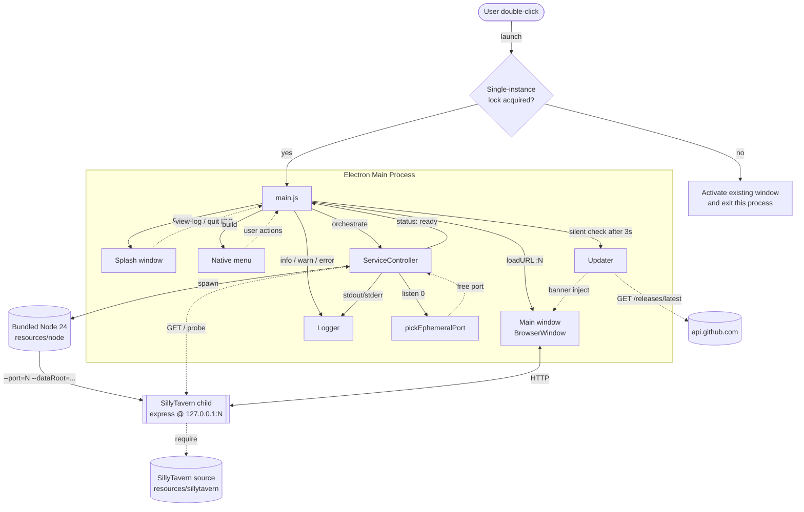

<p align="center">
  
</p>

<h1 align="center">EazySillyTavern</h1>

<p align="center"><strong>A zero-dependency desktop launcher for SillyTavern. Download, double-click, use.</strong></p>

<p align="center">
  <a href="https://github.com/yuman07/EazySillyTavern/releases/latest"></a>
  <a href="https://github.com/yuman07/EazySillyTavern/releases"></a>
  <a href="https://github.com/yuman07/EazySillyTavern/stargazers"></a>
  <br>
  
  
  
  
  <a href="LICENSE"></a>
</p>

<p align="center"><a href="README.md">English</a> | <a href="README_ZH.md">中文</a></p>

---

## What is EazySillyTavern?

[SillyTavern](https://github.com/SillyTavern/SillyTavern) is a popular LLM roleplay frontend, but installing it is a pain: install Node.js, clone the repo, run `npm install`, then `start.sh` / `start.bat`, then open a browser. Nothing about it is friendly to non-technical users.

EazySillyTavern is a **launcher and distribution shell**. The Node 24 LTS runtime, the SillyTavern source, all production npm dependencies and an Electron container are pre-bundled into a single installer. You download one file, double-click, and you are in the SillyTavern UI. **No Node install. No terminal. No environment variables.** Closing the window fully exits the app — there is no background daemon.

EazySillyTavern does **not** reimplement any SillyTavern feature. The UI, character cards, extensions and chat behavior are SillyTavern's, untouched. We just take care of "make it run".

```
+-----------+     +-----------+     +--------------+
| Download  | --> |  Double-  | --> | SillyTavern  |
|  1 file   |     |   click   |     |     UI       |
+-----------+     +-----------+     +--------------+
```

## Features

- **Zero-dependency launch** — no Node install, no terminal, no env vars. SillyTavern + Node 24 LTS + Electron in one installer.
- **Single-instance lock** — a second double-click focuses the existing window instead of starting another copy.
- **Truly local** — SillyTavern is bound to `127.0.0.1` on a random ephemeral port (49152–65535). Nothing is exposed to your LAN, ever.
- **Persistent data** — characters, chats, secrets and presets live in the OS user-data directory. Reinstalling, upgrading or moving to a new EazySillyTavern release never loses data.
- **Bilingual launcher UI** — splash, menus, About box and update banner pick up English / Chinese (Simplified + Traditional) automatically from `app.getLocale()`. Manual switching is intentionally not exposed.
- **Adaptive readiness probe** — tight 50 ms HTTP polling for the first second, widening to 200 ms — typical launches reach the main window 1–8 s after double-click without burning CPU on slow machines.
- **Self-debuggable** — startup failure keeps the splash open with an error message and a "View log" button that opens the log file in the system file manager. No silent crashes.
- **No telemetry** — the only network call is the silent GitHub Release check ~3 s after launch. No identifiers, no analytics.
- **Tiny uninstall footprint** — Windows is portable (no registry, no Program Files); macOS is just an `.app` you drag to Trash.

## Screenshots

<p align="center">
  
  
</p>

<p align="center">
  
</p>

## Install

> EazySillyTavern is **not code-signed** on either platform. Both Apple's Gatekeeper and Microsoft SmartScreen will flag it on first launch — we walk through the bypass below for each platform. (We do not buy a US$99/yr Apple Developer Program seat or a Windows code-signing certificate; passing those costs to free-app users isn't worth the warning saved.)

### macOS (15.0+, Apple Silicon)

> Intel Macs and macOS 14 or earlier are not supported — install SillyTavern from source instead.

1. Go to **[Releases](https://github.com/yuman07/EazySillyTavern/releases/latest)** and download `EazySillyTavern-{version}-mac-arm64.dmg`.
2. Open the dmg and drag `EazySillyTavern.app` into the `Applications` folder.
3. The first launch needs to bypass Gatekeeper. Pick whichever you prefer:

#### Option 1 — System Settings (recommended on macOS 15+)

1. Double-click `EazySillyTavern.app` once. macOS will block it with "Apple could not verify…".
2. Open **System Settings → Privacy & Security**, scroll to the bottom and click **"Open Anyway"** next to the EazySillyTavern entry.
3. Confirm with **"Open"** when macOS asks again.
4. Subsequent launches work normally.

#### Option 2 — Right-click open

1. In Finder, right-click (or Control-click) `EazySillyTavern.app`.
2. Choose **Open** from the context menu.
3. Click **Open** again in the warning dialog.
4. Subsequent launches work normally.

#### Option 3 — Strip the quarantine attribute

```bash
xattr -cr /Applications/EazySillyTavern.app
```

Then double-click as usual.

### Windows (10/11, x64)

> Windows ARM64 is not supported. EazySillyTavern is shipped as a **portable executable** — it does **not** write the Windows registry and does **not** install into Program Files. Deleting the `.exe` is the uninstall.

1. Go to **[Releases](https://github.com/yuman07/EazySillyTavern/releases/latest)** and download `EazySillyTavern-{version}-win-x64.exe`.
2. Move the `.exe` to wherever you want it to live (Desktop, dedicated folder, USB drive…). Double-click to launch.
3. SmartScreen will show a blue dialog **"Windows protected your PC"**:
   1. Click the small **"More info"** link.
   2. Click the new **"Run anyway"** button at the bottom.
4. Subsequent launches start without the warning.

## Usage

The first time SillyTavern starts you'll be asked for a persona name and the language for SillyTavern's own UI (separate from EazySillyTavern's launcher locale). Pick anything — both are changeable inside SillyTavern later.

EazySillyTavern-specific menu entries you should know about:

- **File → Open data directory** — opens the directory that holds character cards, chats, secrets and world info, ready to copy somewhere for backup.
- **File → Open log directory** — opens the rolling startup logs (last 20 kept). Attach the latest `startup-*.log` when filing a GitHub issue.
  - ⚠ Logs are **not redacted**. They may contain API keys you typed into SillyTavern. Review the file before sharing.
- **File → Check for updates** — manually triggers a GitHub Release check. The app also checks silently ~3 s after launch and shows a banner if a new version is available; updates are never auto-downloaded.
- **Closing the window quits the app** on every platform, including macOS. There is intentionally no "hide to dock" behavior. If SillyTavern feels unresponsive, just close and reopen.

User data lives at:

| Platform | Path |
| --- | --- |
| macOS | `~/Library/Application Support/EazySillyTavern/` |
| Windows | `%APPDATA%\EazySillyTavern\` |

```
EazySillyTavern/
|-- data/    # SillyTavern user data: characters, chats, secrets, world info
|-- logs/    # Rolling startup logs (last 20)
`-- config/  # Reserved for launcher-side config
```

## Development

> EazySillyTavern only documents the **macOS** development path. Windows builds are produced cross-platform from a Mac (`devbox run -- npm run release:win`) and on the GitHub Actions `windows-2025` runner — there is no documented Windows-host workflow. Contributors on Windows: please use WSL or build via CI.

### Recommended prerequisites

| Dependency | Version |
| --- | --- |
| macOS | 26.4.1 (Tahoe) |
| Xcode Command Line Tools | 26.4.1 |
| Devbox | 0.17.2 |

<sub>This is the development environment the maintainer actively uses; these versions are known to build cleanly. Older versions may also work, but are untested — no guarantees about correct behavior on lower versions.</sub>

> Node.js, npm, electron-builder and the bundled Node 24 binary are all pulled in by `devbox` / `npm` / `npm run prep` automatically. **Do not install any of them manually** — `devbox.json` is the source of truth.

### Checking and installing prerequisites

#### macOS version

- **Check**: Apple menu → About This Mac, or `sw_vers` in Terminal.
- **Upgrade (recommended)**: System Settings → General → Software Update.

#### Xcode Command Line Tools

- **Check**: `xcode-select -p` (printing a path means it's installed) or `pkgutil --pkg-info=com.apple.pkg.CLTools_Executables`.
- **Install for the first time**: `xcode-select --install`.
- **Upgrade (recommended)**: System Settings → General → Software Update — the CLT shows up alongside macOS updates and is preferred over re-running `xcode-select --install`.

#### Devbox

- **Check**: `devbox version`.
- **Install**: follow the official installer at <https://www.jetify.com/devbox/docs/installing_devbox/>.
- **Upgrade**: `devbox version update`.

### Build steps

```bash
# 1. Clone the repo
git clone https://github.com/yuman07/EazySillyTavern.git
cd EazySillyTavern

# 2. Materialize the toolchain Devbox declares (Node 24, unzip)
devbox install

# 3. Install Electron / electron-builder for the Electron shell itself
devbox run -- npm install

# 4. Fetch the bundled Node 24 binary + clone SillyTavern + install ST production deps
devbox run -- npm run prep

# 5. Run the launcher in dev mode (loads the local SillyTavern source we just prepped)
devbox run -- npm start

# 6. Build distributables
devbox run -- npm run release:mac   # macOS arm64 .dmg
devbox run -- npm run release:win   # Windows x64 portable .exe (cross-build OK from macOS)
```

Build outputs land in `dist/`. CI at `.github/workflows/release.yml` triggers on tags matching `v*`, builds on `macos-26` (arm64) and `windows-2025` runners, and publishes to GitHub Release automatically.

> **Local mac dmg fallback**: on some macOS hosts electron-builder's bundled `dmgbuild` fails with `couldn't unmount diskN — Resource busy` because Spotlight or DiskArbitration is holding the loopback volume. This is a `dmgbuild` Python-side issue, unrelated to EazySillyTavern. Run `devbox run -- npm run build:mac` to produce the `.app`, then `devbox run -- node scripts/pack-mac-dmg.js` to wrap it via raw `hdiutil`. CI runners are clean and never hit this.

### Bumping the bundled SillyTavern

1. Edit `package.json` → `sillytavern.version` to the new release tag.
2. `devbox run -- npm run prep:sillytavern` to refresh `resources/sillytavern/`.
3. Smoke-test locally with `devbox run -- npm start`.
4. Re-verify the SillyTavern injection points and root-route behavior described in `SPEC.md` §十二. Version bumps occasionally rename CLI flags or move routes.
5. Push a `vX.Y.Z` tag; CI builds and releases.

## Technical Overview

EazySillyTavern is intentionally thin. The Electron main process owns three responsibilities: keep the app to a single instance, supervise a SillyTavern Node child process, and present a webview pointed at that child's localhost server. There is no cross-process state synchronization, no plugin system, and no rendering glue layer over the SillyTavern UI — Electron loads `http://127.0.0.1:{port}/` and the rest is SillyTavern's own SPA.

The two non-trivial pieces of internal logic are the **service-readiness probe** and the **ephemeral-port pick + retry**. Everything else is wiring: an i18n helper that branches on `zh-*`, a rolling logger, a native menu, a GitHub Release polling job, and small splash IPC.

### Tech stack

| Layer | Technology |
| --- | --- |
| Native shell | [Electron](https://www.electronjs.org/) 42 |
| Bundled runtime | [Node.js](https://nodejs.org/) 24 LTS (24.15.0) |
| Embedded app | [SillyTavern](https://github.com/SillyTavern/SillyTavern) 1.18.0 |
| Packaging | [electron-builder](https://www.electron.build/) 26 |
| Project env | [Devbox](https://www.jetify.com/devbox) 0.17.2 |
| CI | GitHub Actions on `macos-26` + `windows-2025` |
| Language | JavaScript (Node) |
| License | AGPL-3.0 |

### Architecture



- **Single-instance lock** — `main.js` calls `app.requestSingleInstanceLock()` first thing. Failure means another copy is running, so we activate that one (`second-instance` event handler) and `app.quit()` ourselves. This is what makes a second double-click feel like "bring the existing window forward" instead of "start a new copy".
- **Splash → main handoff** — the splash window opens before any other work so the user sees a frame within ~50 ms. Splash IPC has a small outbox (`splashOutbox`) that buffers `splash:status` / `splash:error` messages until the renderer fires `splash:request-strings`, fixing a race where an immediate failure (e.g. `missing_bundle`) was dispatched before the splash was alive and silently dropped.
- **Service spawn** — `ServiceController` allocates a port, spawns the **bundled** Node 24 binary (not Electron's built-in Node — see below), and feeds SillyTavern its CLI flags + `SILLYTAVERN_ENABLEUSERACCOUNTS=false` env override. `stdout` / `stderr` are piped into the per-launch log file.
- **Readiness probe** — adaptive HTTP polling (`50 ms / 100 ms / 200 ms` tiers, `30 s` total budget) on `GET http://127.0.0.1:{port}/`. The first response, regardless of status code, flips state to `ready` and the main window's `loadURL` fires.
- **Crash detection** — `child.on('exit')` distinguishes intentional shutdown (`stop()` sets `signal.aborted`) from a runtime crash. Post-ready crashes inject a banner into the main window via `updater.js → showServiceCrashedBanner`, asking the user to relaunch instead of silently auto-restarting.
- **Update check** — `setTimeout` fires `silentCheck` 3 s after launch, fetching `api.github.com/repos/yuman07/EazySillyTavern/releases/latest`; a tag mismatch shows a non-blocking banner. Manual checks via the menu always show a result dialog. There is no auto-download — clicking the banner opens the Releases page in the system browser.

### Service-readiness probe

| Resource | Source | Constraint |
| --- | --- | --- |
| Random ephemeral port | `net.createServer().listen(0, '127.0.0.1')` | IANA dynamic range 49152–65535; OS picks; we close immediately. |
| Probe target | `GET http://127.0.0.1:{port}/` | Any HTTP response (200 / 302 / 401) counts as ready. |
| Total budget | 30 s wall clock | Covers HDD + AV-scan worst case; longer is "give up and surface error". |
| Poll cadence | 50 ms (0–1 s), 100 ms (1–3 s), 200 ms (3 s+) | Tight early polling captures fast launches; widens to bound CPU on slow machines. |

**How and why:**

- **Why probe at all** — between `child.spawn()` and `server.listen()` SillyTavern does ~1–8 s of work (plugin load, settings init, webpack cache build). Loading the main window any earlier shows `ERR_CONNECTION_REFUSED`. A flat sleep is wrong on both ends: too short on slow disks, too long on fast ones.
- **Why HTTP, not stdout grep** — SillyTavern's startup log lines aren't a stable contract; they get rewritten across releases. HTTP probing depends only on "the socket accepts connections and the root route returns something", which is a much harder API to break.
- **Why the root path** — the root route is registered at the top of `src/server-main.js` before `server.listen()`, and with `enableUserAccounts=false` it returns the SillyTavern index directly (no 302 to `/login`). There is no "listening but routing not ready" window.
- **Why an adaptive cadence** — most launches resolve in 1–2 seconds. Polling at 50 ms for the first second saves up to ~150 ms of perceived launch delay on fast machines without sustaining 20 req/s for a slow 8-second launch (which would generate ~120 wasted probes).
- **Why `child.on('exit')` short-circuits the loop** — without it, a SillyTavern crash on startup forces us to wait the full 30 s before reporting failure. With it, we fail fast with the more helpful `service_crashed` reason instead of `timeout`.
- **Why no auto-restart on a post-ready crash** — for the target user (non-technical), silent retry hides the problem. We surface a banner asking the user to relaunch, with the log path one menu click away.

Time complexity is `O(elapsed/interval)` probes — typically 30 to 80 in practice, each well under a millisecond of CPU on the main process.

### Ephemeral-port pick and retry

| Resource | Source | Constraint |
| --- | --- | --- |
| Candidate port | OS-allocated via `listen(0)` | Always in dynamic range, always free at allocation time. |
| Race window | TOCTOU between our `close()` and the child's `listen()` | A different process can grab the port; child crashes with `EADDRINUSE`. |
| Retry budget | 3 attempts, only on `service_crashed` reason | Other failures (`fork_failed`, `missing_bundle`) don't recover by retrying. |

**How and why:**

- **Why not a fixed port** — fixing 8000 (SillyTavern's default) collides with users running SillyTavern from source on the same machine, plus any other dev server. The cost is one trivial OS call per launch; the benefit is "no port conflict" as a hard guarantee for the non-technical user.
- **Why `listen(0)` instead of a hand-rolled scanner** — letting the kernel pick avoids a TOCTOU racier than the one we already have, and the kernel never returns a port that's currently in use. The remaining race is the few microseconds between our `close()` and the child binding — that's where the retry exists.
- **Why retry only on `service_crashed`** — a `fork_failed` or `missing_bundle` (Node binary or SillyTavern source missing) is not a port problem and won't fix itself. Retrying those would just delay the inevitable error message.
- **Why 3 attempts** — empirically, the TOCTOU race in the dynamic-port range fires far below 1% of the time. Three independent rolls drop the chance of three consecutive losses below `1e-6`, well within "good enough for a desktop launcher".

### Why a separate bundled Node binary

Electron 42 ships its own Node, but `crypto.createHash('shake256')` throws `Error: Digest method not supported` because Electron uses BoringSSL — and BoringSSL omits the SHA-3 / SHAKE family. SillyTavern 1.18.0's `webpack.config.js` calls `createHash('shake256')` in `getWebpackCacheVersion()`; the child would die in `preSetupTasks()` before opening any port. `--openssl-legacy-provider` is not recognized by Electron's Node either.

Bundling a vanilla Node 24 LTS binary (≈25 MB on macOS arm64, ≈30 MB on Windows x64) sidesteps the entire BoringSSL question. It costs us a single download in `scripts/prep-node.js` at build time and a flat copy into `extraResources/node/` at packaging time. The total installer still fits comfortably under SPEC §十一-12's 250 MB ceiling.

### Repository layout

```
EazySillyTavern/
|-- src/                       # Electron main-process code (only entry point)
|   |-- main.js                # entry: single-instance lock, splash, bootstrap, IPC
|   |-- lifecycle.js           # ServiceController: spawn / probe / kill SillyTavern child
|   |-- port.js                # pickEphemeralPort via net.createServer().listen(0)
|   |-- paths.js               # OS-aware userData / data / logs / config paths
|   |-- logger.js              # rolling per-launch log file in userData/logs (last 20)
|   |-- menu.js                # native app menu — opens data/log dirs, manual update, About
|   |-- updater.js             # silent + manual GitHub Release polling, banner injection
|   |-- i18n.js                # locale picker (zh-* -> zh, else -> en) + t(key) lookup
|   |-- preload/               # contextIsolation preloads for the splash renderer
|   `-- splash/                # splash window: HTML / CSS / renderer JS
|-- i18n/                      # zh.json / en.json — launcher-side strings only
|-- scripts/                   # build-time helpers (run via npm scripts)
|   |-- prep-node.js           # download Node 24 LTS (mac arm64 / win x64), extract binary
|   |-- prep-sillytavern.js    # clone SillyTavern at pinned tag, npm install --omit=dev
|   |-- pack-mac-dmg.js        # raw-hdiutil dmg fallback for flaky local mac builds
|   |-- build-icon.js          # rasterize the source SVG into platform-sized icons
|   `-- render-icon.js         # SVG -> PNG renderer used by build-icon.js
|-- resources/                 # gitignored — populated by `npm run prep`
|   |-- node/                  # bundled Node 24 LTS binary
|   `-- sillytavern/           # SillyTavern source + production node_modules
|-- build/                     # electron-builder buildResources directory
|   |-- icon.png               # rasterized app icon
|   `-- icon.svg               # source app icon (themed mug + AI sparkles)
|-- screenshots/               # README screenshots only
|-- .github/workflows/
|   `-- release.yml            # tag-triggered CI: build mac arm64 + win x64, publish Release
|-- electron-builder.yml       # asar / extraResources / per-platform packaging config
|-- devbox.json                # nodejs@24 + unzip
|-- devbox.lock                # devbox dependency lockfile
|-- package.json               # scripts: prep / start / build:* / release:*
|-- SPEC.md                    # authoritative product + technical spec — read this first
|-- LICENSE                    # AGPL-3.0
|-- README.md                  # this file (English)
`-- README_ZH.md               # Chinese mirror
```

## FAQ

**Q: The app crashes immediately on launch and the splash says "service crashed" — what now?**

> Click **View log**, then look at the most recent `startup-*.log`. The most common cause is antivirus quarantining files inside the bundled SillyTavern `node_modules`. Reinstalling EazySillyTavern (replacing the `.app` / `.exe`) re-creates them.

**Q: I want SillyTavern accessible from my phone / tablet / another machine on my LAN.**

> EazySillyTavern intentionally does not support this. The SillyTavern child is hard-bound to `127.0.0.1` and there is no setting to change that. If you need LAN access, use SillyTavern's source-based install — it's the right tool for that job.

**Q: Where are my chats / character cards stored? How do I back them up?**

> macOS: `~/Library/Application Support/EazySillyTavern/data/`. Windows: `%APPDATA%\EazySillyTavern\data\`. Use **File → Open data directory** in the app menu and copy the whole folder anywhere you like — that is the backup.

**Q: Is there auto-update?**

> No. The app silently checks GitHub Releases ~3 s after launch and shows a banner if there's a new version, but the download and install are manual. Click the banner, download the new installer, and replace the old one.

**Q: Can I run two SillyTavern profiles in parallel by launching EazySillyTavern twice?**

> No — that would mean racing on the same data directory. The single-instance lock catches the second launch and brings the existing window to the foreground.

**Q: Does EazySillyTavern read or send my LLM API keys anywhere?**

> No. API keys are entered into SillyTavern, stored by SillyTavern in its `data/` directory, and used by SillyTavern when it makes outbound calls to your provider. EazySillyTavern doesn't touch them. The only network call EazySillyTavern itself makes is to `api.github.com` to check for new releases.

## Acknowledgements

EazySillyTavern stands on the shoulders of the [SillyTavern](https://github.com/SillyTavern/SillyTavern) team. Every feature you actually use is theirs — this project just shaves the install down to a double-click.

The Electron, Node.js and electron-builder maintainers also deserve a thank-you: they do an enormous amount of unglamorous work that makes single-installer cross-platform desktop apps practical at all.

## License

EazySillyTavern is released under [AGPL-3.0](LICENSE), in alignment with SillyTavern's own license.
