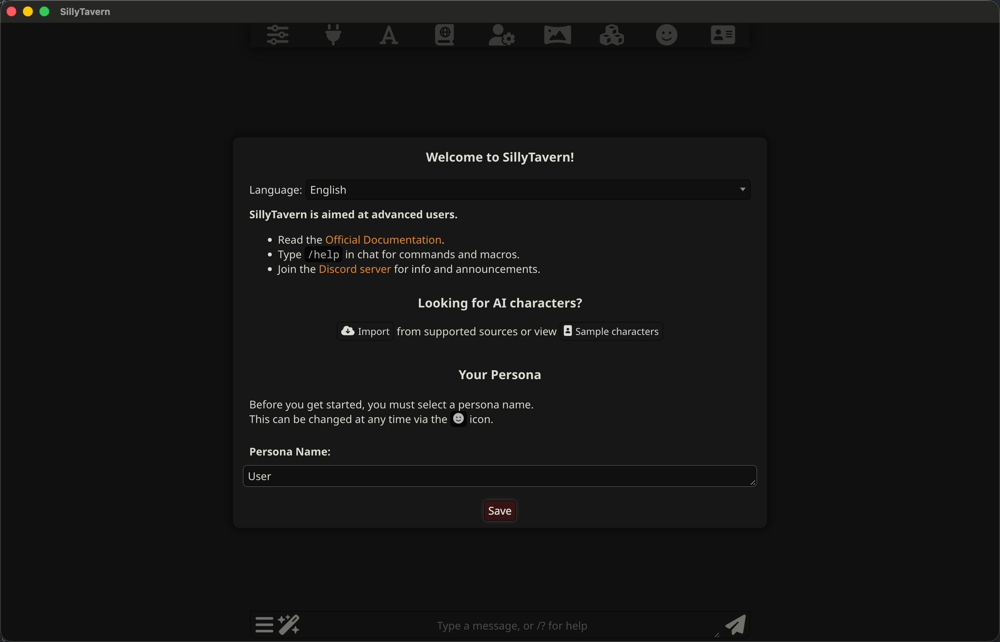
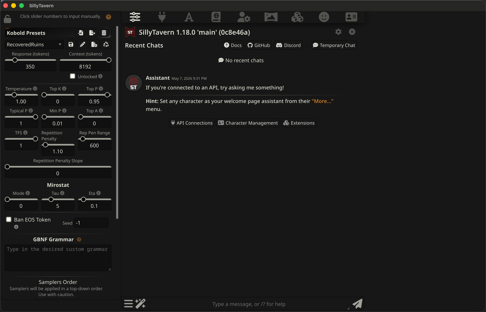
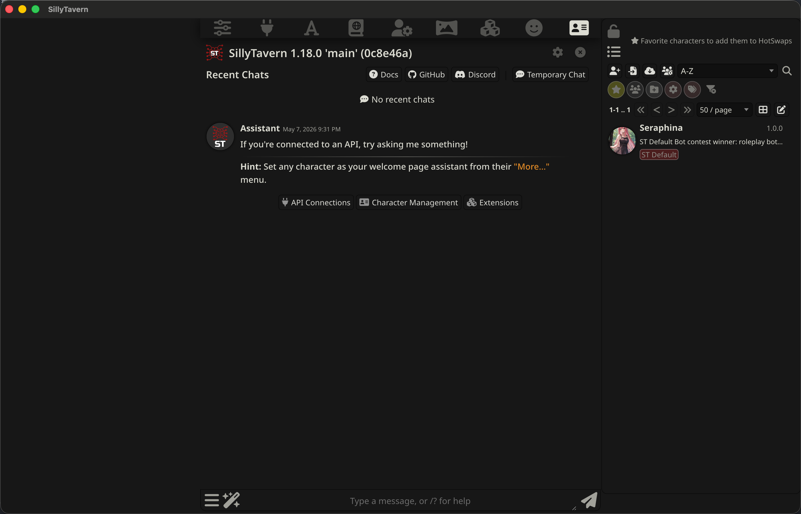
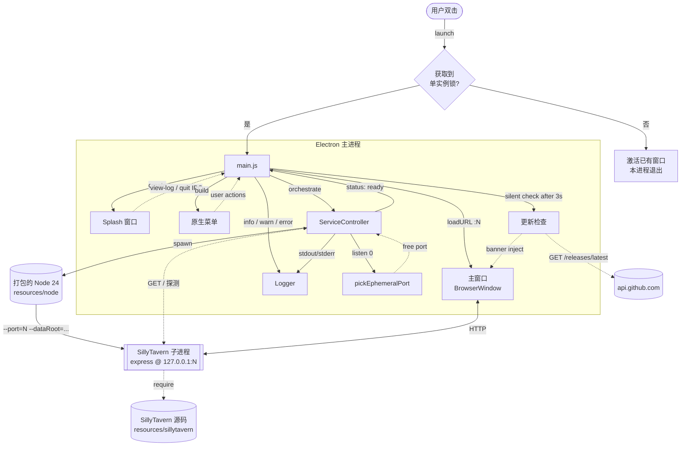

<p align="center">
  
</p>

<h1 align="center">EazySillyTavern</h1>

<p align="center"><strong>SillyTavern 的零依赖桌面发行版。下载、双击、用。</strong></p>

<p align="center">
  <a href="https://github.com/yuman07/EazySillyTavern/releases/latest"></a>
  <a href="https://github.com/yuman07/EazySillyTavern/releases"></a>
  <a href="https://github.com/yuman07/EazySillyTavern/stargazers"></a>
  <br>
  
  
  
  
  <a href="LICENSE"></a>
</p>

<p align="center"><a href="README.md">English</a> | <a href="README_ZH.md">中文</a></p>

---

## EazySillyTavern 是什么

[SillyTavern](https://github.com/SillyTavern/SillyTavern) 是一个流行的 LLM 角色扮演前端，但部署门槛真的不低：装 Node.js、克隆仓库、跑 `npm install`、再用 `start.sh` / `start.bat` 启动、然后手动开浏览器。整套流程对不熟悉命令行的用户极不友好。

EazySillyTavern 是一层 **启动器与发行容器**——把 Node 24 LTS runtime、SillyTavern 源码、所有生产 npm 依赖以及一个 Electron 外壳打成单个安装包。下载一个文件、双击，就直接进 SillyTavern 主界面。**不用装 Node、不用开终端、不用配环境变量。** 关掉窗口就完全退出，不留后台守护进程。

EazySillyTavern **不重新实现** SillyTavern 的任何业务逻辑。UI、角色卡、扩展、聊天行为完全是 SillyTavern 原生的，本项目只把"让它跑起来"这件事做得轻一点。

```
+-----------+     +-----------+     +--------------+
|  下载     | --> |   双击    | --> | SillyTavern  |
|  1 个文件 |     |           |     |    主界面    |
+-----------+     +-----------+     +--------------+
```

## 功能特点

- **零依赖启动** — 不用装 Node、不开终端、不配环境变量。SillyTavern + Node 24 LTS + Electron 一个安装包搞定。
- **单实例锁** — 第二次双击会激活已有窗口，而不是再开一个进程。
- **完全本机** — SillyTavern 强制绑定 `127.0.0.1`，端口在 49152–65535 范围内随机选取。**永远不会暴露给局域网**。
- **数据持久化** — 角色卡、聊天、密钥、preset 都存在系统标准用户目录下。重装、升级、跨版本切换都不会丢数据。
- **双语启动器 UI** — splash、菜单、关于框、更新 banner 通过 `app.getLocale()` 自动选英文 / 简繁中文资源。**不提供** 应用内手动切换入口。
- **自适应就绪探测** — 头一秒 50ms 紧密轮询，之后逐步放宽到 200ms。典型双击到主界面 1–8 秒，慢机器也不会被探测压垮。
- **可自助排错** — 启动失败 splash 不关、显示错误信息和「查看日志」按钮，直接打开日志所在目录。绝不静默崩溃。
- **零遥测** — 唯一的网络调用是启动 3 秒后向 GitHub Release 发的更新检查请求。不带任何标识、不做任何分析。
- **卸载零残留** — Windows 是 portable（不写注册表、不进 Program Files），macOS 把 `.app` 拖废纸篓即可。

## 截图

<p align="center">
  
  
</p>

<p align="center">
  
</p>

## 安装

> EazySillyTavern **不进行代码签名**。两个平台首次启动都会被系统拦截——下面分平台给出绕过步骤。（每年 99 美元的 Apple Developer Program / 数百美元的 Windows 代码签名证书都不便宜，作为免费软件没必要把这笔费用转嫁给用户。）

### macOS（15.0+，Apple Silicon）

> 不支持 Intel Mac、不支持 macOS 14 及更早版本——这些设备请使用 SillyTavern 官方源码部署。

1. 打开 **[Releases 页面](https://github.com/yuman07/EazySillyTavern/releases/latest)**，下载 `EazySillyTavern_macOS15_arm64_{version}.dmg`。
2. 打开 dmg，把 `EazySillyTavern.app` 拖到 `应用程序 / Applications` 文件夹。
3. 首次启动需要绕过 Gatekeeper，下面三种任选其一：

#### 方式 1：系统设置（macOS 15+ 推荐）

1. 双击一次 `EazySillyTavern.app`，macOS 会弹出"无法验证开发者"的拦截框。
2. 打开 **系统设置 → 隐私与安全性**，滚到底部，在 EazySillyTavern 那一栏点 **「仍要打开」/「Open Anyway」**。
3. macOS 会再次确认，点 **「打开」**。
4. 之后正常双击启动即可。

#### 方式 2：右键打开

1. 在 Finder 中右键（或按住 Control 单击） `EazySillyTavern.app`。
2. 在右键菜单中选 **打开 / Open**。
3. 弹出的警告框里再点一次 **打开**。
4. 之后正常双击启动即可。

#### 方式 3：清除隔离属性

```bash
xattr -cr /Applications/EazySillyTavern.app
```

之后正常双击即可。

### Windows（10/11，x64）

> 不支持 Windows ARM64。EazySillyTavern 是 **portable executable**——**不写注册表**、**不安装到 Program Files**。删除 `.exe` 即等于卸载。

1. 打开 **[Releases 页面](https://github.com/yuman07/EazySillyTavern/releases/latest)**，下载 `EazySillyTavern_Windows10_x64_{version}.exe`。
2. 把 `.exe` 放到任意目录（桌面、专门的文件夹、U 盘都行）双击启动。
3. SmartScreen 会弹出蓝色提示 **"Windows 已保护你的电脑"**：
   1. 点击左下角的 **「更多信息 / More info」** 链接。
   2. 点击底部新出现的 **「仍要运行 / Run anyway」** 按钮。
4. 之后正常双击启动即可。

## 使用说明

第一次启动 SillyTavern 会让你输入 persona 名字并选择 SillyTavern 自己的 UI 语言（这与 EazySillyTavern 启动器的语言是两回事）。随便填——之后在 SillyTavern 内都能改。

EazySillyTavern 特有的几个菜单项：

- **文件 → 打开数据目录** — 打开存放角色卡、聊天、密钥、世界书的目录，方便备份。
- **文件 → 打开日志目录** — 打开滚动启动日志（保留最近 20 个）。提交 GitHub issue 时附带最新的 `startup-*.log`。
  - ⚠ 日志 **不脱敏**，可能含有你在 SillyTavern 里输入过的 API key。分享前请自己检查。
- **文件 → 检查更新** — 手动触发一次 GitHub Release 检查。应用启动 3 秒后也会静默检查，发现新版会显示 banner，不会自动下载。
- **关闭窗口 = 退出应用**，包括 macOS。**没有** "藏到 Dock 不退出" 的传统行为。SillyTavern 卡了就关掉再开。

数据存放位置：

| 平台 | 路径 |
| --- | --- |
| macOS | `~/Library/Application Support/EazySillyTavern/` |
| Windows | `%APPDATA%\EazySillyTavern\` |

```
EazySillyTavern/
|-- data/    # SillyTavern 用户数据：角色卡、聊天、密钥、世界书
|-- logs/    # 滚动启动日志（保留最近 20 个）
`-- config/  # EazySillyTavern 自身配置（预留扩展位）
```

## 开发

> EazySillyTavern 只提供 **macOS** 平台的开发流程。Windows 安装包通过 macOS 跨平台构建（`devbox run -- npm run release:win`）以及 GitHub Actions 上的 `windows-2025` runner 产出，**没有** Windows 本机开发流程的官方文档。Windows 用户请用 WSL 或走 CI。

### 推荐前置要求

| 依赖 | 版本 |
| --- | --- |
| macOS | 26.4.1 (Tahoe) |
| Xcode Command Line Tools | 26.4.1 |
| Devbox | 0.17.2 |

<sub>这是维护者本机的开发环境，是经过实测可以正常构建运行的版本。低于此版本或许也能跑通，但未经测试，对效果不做保证。</sub>

> Node.js、npm、electron-builder 以及打包用的 Node 24 二进制都由 `devbox` / `npm` / `npm run prep` 自动拉取。**不要手动安装这些工具**——`devbox.json` 是依赖的唯一来源。

### 前置环境检查与配置

#### macOS 版本

- **检查**：苹果菜单 → 关于本机，或终端运行 `sw_vers`。
- **升级（推荐）**：系统设置 → 通用 → 软件更新。

#### Xcode Command Line Tools

- **检查**：`xcode-select -p`（输出路径就是已装），或 `pkgutil --pkg-info=com.apple.pkg.CLTools_Executables`。
- **首次安装**：`xcode-select --install`。
- **升级（推荐）**：系统设置 → 通用 → 软件更新——CLT 会随 macOS 更新一起出现，比重新跑 `xcode-select --install` 更省事。

#### Devbox

- **检查**：`devbox version`。
- **安装**：参考官方文档 <https://www.jetify.com/devbox/docs/installing_devbox/>。
- **升级**：`devbox version update`。

### 构建步骤

```bash
# 1. 克隆仓库
git clone https://github.com/yuman07/EazySillyTavern.git
cd EazySillyTavern

# 2. 物化 Devbox 声明的工具链（Node 24、unzip）
devbox install

# 3. 安装 Electron / electron-builder 等 Electron 外壳依赖
devbox run -- npm install

# 4. 拉取 Node 24 二进制 + 克隆 SillyTavern + 装 ST 生产依赖
devbox run -- npm run prep

# 5. dev 模式启动启动器（加载本地 prep 出来的 SillyTavern 源码）
devbox run -- npm start

# 6. 构建发行包
devbox run -- npm run release:mac   # macOS arm64 .dmg
devbox run -- npm run release:win   # Windows x64 portable .exe（macOS 上跨平台构建即可）
```

构建产物在 `dist/` 目录。CI 配置 `.github/workflows/release.yml` 在 `v*` tag push 时自动触发，在 `macos-26`（arm64）和 `windows-2025` runner 上构建并发布到 GitHub Release。

> **本地 mac dmg 构建失败的回退方案**：某些 macOS 主机上 electron-builder 内嵌的 `dmgbuild` 会因为 Spotlight 或 DiskArbitration 占住回环卷而以 `couldn't unmount diskN — Resource busy` 失败。这是 `dmgbuild` Python 那一层的环境问题，与 EazySillyTavern 代码无关。先跑 `devbox run -- npm run build:mac` 出 `.app`，再跑 `devbox run -- node scripts/pack-mac-dmg.js` 用裸 `hdiutil` 打包成 dmg，绕过这一层。CI runner 是干净环境，不会触发该问题。

### 升级内嵌的 SillyTavern

1. 修改 `package.json` → `sillytavern.version` 为新的 release tag。
2. 跑 `devbox run -- npm run prep:sillytavern` 重新拉取 `resources/sillytavern/`。
3. 本地 smoke test（`devbox run -- npm start`）。
4. 重新核对 `SPEC.md` §十二 中描述的 SillyTavern 注入点和根路由行为——版本 bump 偶尔会改 CLI flag 名字或挪路由。
5. push `vX.Y.Z` tag，CI 自动构建发布。

## 技术概览

EazySillyTavern 刻意做得很薄。Electron 主进程只负责三件事：保持单实例、监管一个 SillyTavern Node 子进程、用一个 webview 加载子进程的 localhost 服务。**没有** 跨进程状态同步、**没有** 插件系统、**没有** 套在 SillyTavern UI 之上的渲染胶水层——Electron 直接 `loadURL('http://127.0.0.1:{port}/')`，剩下都是 SillyTavern 自己的 SPA。

整个项目里两块非平凡的逻辑是 **服务就绪探测** 和 **临时端口选取 + 重试**。其它都是接线：基于 `zh-*` 分流的 i18n 工具、滚动日志、原生菜单、GitHub Release 轮询、几条 splash IPC 而已。

### 技术栈

| 层 | 技术 |
| --- | --- |
| 原生外壳 | [Electron](https://www.electronjs.org/) 42 |
| 内嵌 runtime | [Node.js](https://nodejs.org/) 24 LTS（24.15.0）|
| 内嵌应用 | [SillyTavern](https://github.com/SillyTavern/SillyTavern) 1.18.0 |
| 打包工具 | [electron-builder](https://www.electron.build/) 26 |
| 项目环境 | [Devbox](https://www.jetify.com/devbox) 0.17.2 |
| CI | GitHub Actions（`macos-26` + `windows-2025`）|
| 语言 | JavaScript（Node）|
| License | AGPL-3.0 |

### 架构图



- **单实例锁** — `main.js` 首先调用 `app.requestSingleInstanceLock()`。失败说明已有副本在跑，触发 `second-instance` 事件激活原窗口、本进程 `app.quit()`。这就是"第二次双击 = 激活已有窗口"而不是"再开一个"的实现根源。
- **Splash → 主窗交接** — splash 窗口在所有其它工作之前打开，让用户在 ~50ms 内看到画面。Splash IPC 内置一个小 outbox（`splashOutbox`），缓冲渲染端 ready 之前发出的 `splash:status` / `splash:error` 消息，规避一种竞态：早期失败（如 `missing_bundle`）发生在 splash 渲染端启动前，消息会被静默丢弃。
- **服务启动** — `ServiceController` 选端口、spawn **打包的** Node 24 二进制（不用 Electron 自带的 Node，原因见下文），把 CLI 参数和 `SILLYTAVERN_ENABLEUSERACCOUNTS=false` 环境变量喂给 SillyTavern。子进程 `stdout` / `stderr` 全部导向当次启动的日志文件。
- **就绪探测** — 自适应 HTTP 轮询（`50ms / 100ms / 200ms` 三档，总预算 `30s`），探测 `GET http://127.0.0.1:{port}/`。任意 HTTP 响应（200 / 302 / 401）都视为就绪，状态翻 `ready`，主窗 `loadURL` 触发。
- **崩溃感知** — `child.on('exit')` 区分主动关闭（`stop()` 设置 `signal.aborted`）和运行期崩溃。Ready 之后的崩溃通过 `updater.js → showServiceCrashedBanner` 在主窗注入提示 banner，劝用户重启应用——而不是静默自动重启。
- **更新检查** — 启动后 `setTimeout` 3 秒触发 `silentCheck`，请求 `api.github.com/repos/yuman07/EazySillyTavern/releases/latest`，tag 不一致就插入非阻塞 banner。菜单手动检查总会弹出结果对话框。**不自动下载**——点 banner 跳到 Releases 页面用系统浏览器打开。

### 服务就绪探测算法

| 资源 | 来源 | 约束 |
| --- | --- | --- |
| 临时端口 | `net.createServer().listen(0, '127.0.0.1')` | IANA 动态端口段 49152–65535；OS 选；选完立即 close。 |
| 探测端点 | `GET http://127.0.0.1:{port}/` | 任意 HTTP 响应（200 / 302 / 401）都算就绪。 |
| 总预算 | 30 秒墙钟 | 覆盖 HDD + 杀软扫描的最坏场景，再长就直接报错。 |
| 轮询节奏 | 50ms（0–1s）、100ms（1–3s）、200ms（3s+） | 早期紧密轮询接住快速启动，后期放宽避免慢机器空转。 |

**怎么做与为什么这样做：**

- **为什么必须探测** — `child.spawn()` 到 `server.listen()` 之间 SillyTavern 要做 1–8 秒的工作（加载插件、init settings、构建 webpack cache）。早一点 `loadURL` 就会看到 `ERR_CONNECTION_REFUSED`。固定 sleep 两边都不对：慢盘上太短、快盘上太长。
- **为什么用 HTTP 而不是 grep 子进程 stdout** — SillyTavern 的启动日志行不是稳定契约，跨版本会被改。HTTP 探测只依赖"socket 接受连接 + 根路由有响应"——这是远更难破坏的接口。
- **为什么探测根路径** — 根路由在 `src/server-main.js` 顶层就注册好（早于 `server.listen()`），且 `enableUserAccounts=false` 时根路径直接返回 SillyTavern 的 index 页（不会 302 到 `/login`）。不存在"已 listen 但路由没准备好"的窗口。
- **为什么用自适应节奏** — 多数启动 1–2 秒就能完成。头一秒 50ms 轮询能在快机器上节省最多 ~150ms 的可感知延迟，又不至于让 8 秒慢启动里持续 20 req/s（那意味着 ~120 次无效请求）。
- **为什么用 `child.on('exit')` 短路探测循环** — 没它的话，SillyTavern 启动期崩溃要等满 30 秒才报错。有它，立刻以更有用的 `service_crashed` 原因 fail-fast，而不是 `timeout`。
- **为什么 ready 之后的崩溃不自动重启** — 目标用户（小白）面前的静默重试只会掩盖问题。我们显式弹 banner 让用户重启应用，日志路径离菜单只有一次点击。

时间复杂度是 `O(elapsed/interval)`——实际典型 30–80 次探测，每次主进程消耗远小于 1 毫秒 CPU。

### 临时端口选取与重试

| 资源 | 来源 | 约束 |
| --- | --- | --- |
| 候选端口 | OS 通过 `listen(0)` 分配 | 一定在动态端口段、分配时一定空闲。 |
| 竞态窗口 | 我们 `close()` 与子进程 `listen()` 之间的 TOCTOU | 别的进程可能先抢到端口；子进程 `EADDRINUSE` 崩溃。 |
| 重试预算 | 3 次，**仅** 在 `service_crashed` 原因下重试 | 其它失败（`fork_failed`、`missing_bundle`）重试也好不了。 |

**怎么做与为什么这样做：**

- **为什么不固定端口** — 固定 8000（SillyTavern 默认值）会和同机器跑源码版的 SillyTavern、其它 dev server 撞端口。代价是每次启动多调用一次 OS API，换来的是"绝不冲突"作为对小白的硬保证。
- **为什么 `listen(0)` 而不是手写扫描器** — 让 kernel 选避免了一种比现有 TOCTOU 更糟糕的竞态，且 kernel 永远不会返回正在被占用的端口。剩下的窗口就是我们 `close()` 到子进程 bind 之间那几微秒——那正是重试存在的意义。
- **为什么仅 `service_crashed` 重试** — `fork_failed` 或 `missing_bundle`（Node 二进制或 SillyTavern 源码缺失）不是端口问题，重试只会延迟报错。
- **为什么 3 次** — 实测表明动态端口段的 TOCTOU 命中率远低于 1%。三次独立重试连失败的概率压到 `1e-6` 以下，对于桌面启动器"足够好"。

### 为什么单独打包 Node 二进制

Electron 42 自带 Node，但 `crypto.createHash('shake256')` 会抛 `Error: Digest method not supported`——Electron 用的是 BoringSSL，**而 BoringSSL 砍掉了 SHA-3 / SHAKE 系列**。SillyTavern 1.18.0 的 `webpack.config.js` 在 `getWebpackCacheVersion()` 里调用 `createHash('shake256')`，子进程在 `preSetupTasks()` 阶段就直接挂掉，根本来不及监听端口。`--openssl-legacy-provider` 在 Electron Node 上也不识别。

打包一份原版 Node 24 LTS 二进制（macOS arm64 ≈25MB、Windows x64 ≈30MB）彻底绕开 BoringSSL 这个坑。代价是 build 阶段在 `scripts/prep-node.js` 多下载一次、打包阶段平铺复制到 `extraResources/node/` 而已。安装包体积仍然轻松卡进 SPEC §十一-12 的 250MB 上限。

### 仓库结构

```
EazySillyTavern/
|-- src/                       # Electron 主进程代码（唯一入口）
|   |-- main.js                # 入口：单实例锁、splash、bootstrap、IPC
|   |-- lifecycle.js           # ServiceController：spawn / 探测 / 关停 SillyTavern 子进程
|   |-- port.js                # pickEphemeralPort：net.createServer().listen(0)
|   |-- paths.js               # 跨平台 userData / data / logs / config 路径
|   |-- logger.js              # userData/logs 下滚动启动日志（保留最近 20 个）
|   |-- menu.js                # 原生菜单 — 打开数据/日志目录、手动更新、关于
|   |-- updater.js             # 静默 + 手动 GitHub Release 检查、banner 注入
|   |-- i18n.js                # 语言分流（zh-* -> zh，其它 -> en）+ t(key) 查表
|   |-- preload/               # splash 渲染端 contextIsolation preload
|   `-- splash/                # splash 窗口：HTML / CSS / 渲染端 JS
|-- i18n/                      # zh.json / en.json — 仅启动器自身文案
|-- scripts/                   # 构建期辅助脚本（通过 npm scripts 调用）
|   |-- prep-node.js           # 下载 Node 24 LTS（mac arm64 / win x64），解出 binary
|   |-- prep-sillytavern.js    # 按 pinned tag 克隆 SillyTavern + npm install --omit=dev
|   |-- pack-mac-dmg.js        # 本地 mac 构建失败时的 hdiutil dmg 回退
|   |-- build-icon.js          # 把 SVG 渲成各平台所需的 PNG 图标
|   `-- render-icon.js         # SVG -> PNG 渲染器（被 build-icon.js 使用）
|-- resources/                 # 已 gitignored — 由 `npm run prep` 填充
|   |-- node/                  # 打包的 Node 24 LTS 二进制
|   `-- sillytavern/           # SillyTavern 源码 + 生产 node_modules
|-- build/                     # electron-builder buildResources 目录
|   |-- icon.png               # 栅格化后的应用图标
|   `-- icon.svg               # 应用图标源 SVG（主题：酒馆杯 + AI 火花）
|-- screenshots/               # 仅 README 用截图
|-- .github/workflows/
|   `-- release.yml            # tag 触发的 CI：构建 mac arm64 + win x64，发布 Release
|-- electron-builder.yml       # asar / extraResources / 各平台打包配置
|-- devbox.json                # nodejs@24 + unzip
|-- devbox.lock                # devbox 依赖锁文件
|-- package.json               # scripts：prep / start / build:* / release:*
|-- SPEC.md                    # 权威产品 + 技术规格——优先阅读
|-- LICENSE                    # AGPL-3.0
|-- README.md                  # 英文版 README
`-- README_ZH.md               # 本文（中文版）
```

## FAQ

**Q：应用一启动就崩、splash 显示 "service crashed" 怎么办？**

> 点 **「查看日志」**，看最新的 `startup-*.log`。最常见的原因是杀毒软件把 SillyTavern `node_modules` 里的某个文件隔离了。重装 EazySillyTavern（替换 `.app` / `.exe`）可以重新生成它们。

**Q：我想在手机 / 平板 / 局域网另一台机器上访问 SillyTavern。**

> EazySillyTavern 故意不支持。SillyTavern 子进程被硬编码绑定到 `127.0.0.1`，没有任何开关能改。需要局域网访问的话请用 SillyTavern 官方源码部署版——那才是合适的工具。

**Q：聊天记录 / 角色卡存在哪？怎么备份？**

> macOS：`~/Library/Application Support/EazySillyTavern/data/`。Windows：`%APPDATA%\EazySillyTavern\data\`。用应用菜单 **文件 → 打开数据目录**，把整个文件夹拷到任意位置就是备份。

**Q：有自动更新吗？**

> 没有。启动 3 秒后会静默检查 GitHub Release，发现新版会显示 banner，但下载和安装都是手动。点 banner、下新装包、覆盖旧版即可。

**Q：双击两次 EazySillyTavern 能跑两个 SillyTavern profile 吗？**

> 不能——那意味着两个进程争抢同一个数据目录。单实例锁会拦截第二次启动并把已有窗口拉到前台。

**Q：EazySillyTavern 会读取或上传我的 LLM API key 吗？**

> 不会。API key 是你在 SillyTavern 内输入、由 SillyTavern 存到它自己的 `data/` 目录、由 SillyTavern 在请求 LLM 服务时使用。EazySillyTavern 完全不接触。EazySillyTavern 自己的唯一网络行为是访问 `api.github.com` 检查更新。

## 致谢

EazySillyTavern 站在 [SillyTavern](https://github.com/SillyTavern/SillyTavern) 团队的肩膀上。所有有趣的功能都由他们实现，本项目只是把"装它"这件事做得轻一点。

Electron、Node.js、electron-builder 三个团队也值得一谢——他们做了大量不光鲜但极其关键的工作，单安装包跨平台桌面应用才能落地。

## License

EazySillyTavern 采用 [AGPL-3.0](LICENSE)，与 SillyTavern 自身保持一致。
